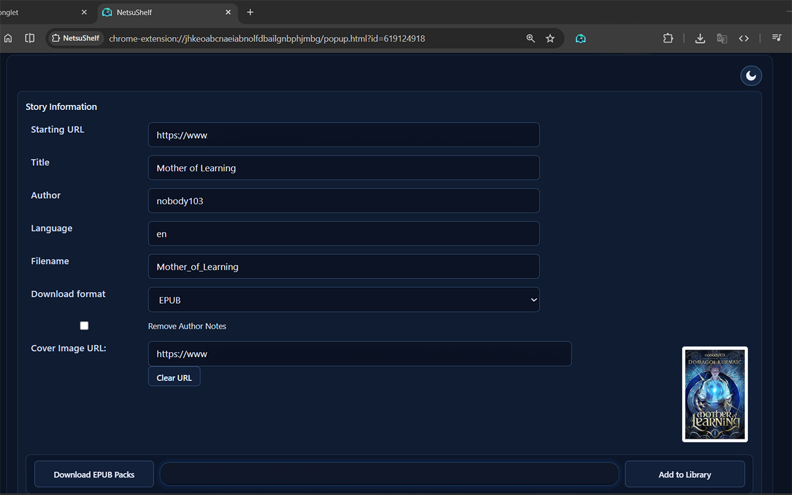
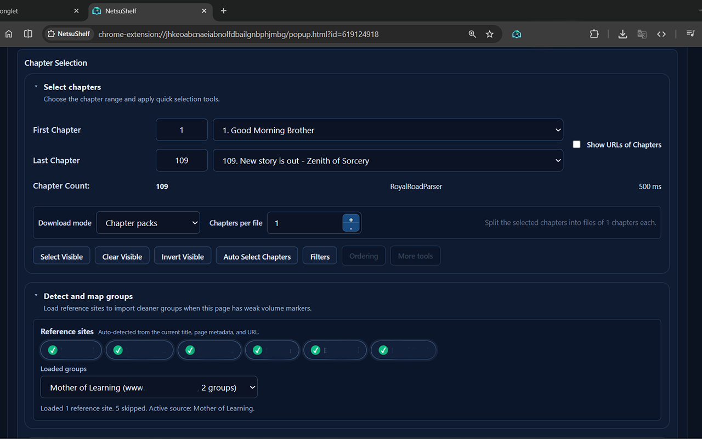
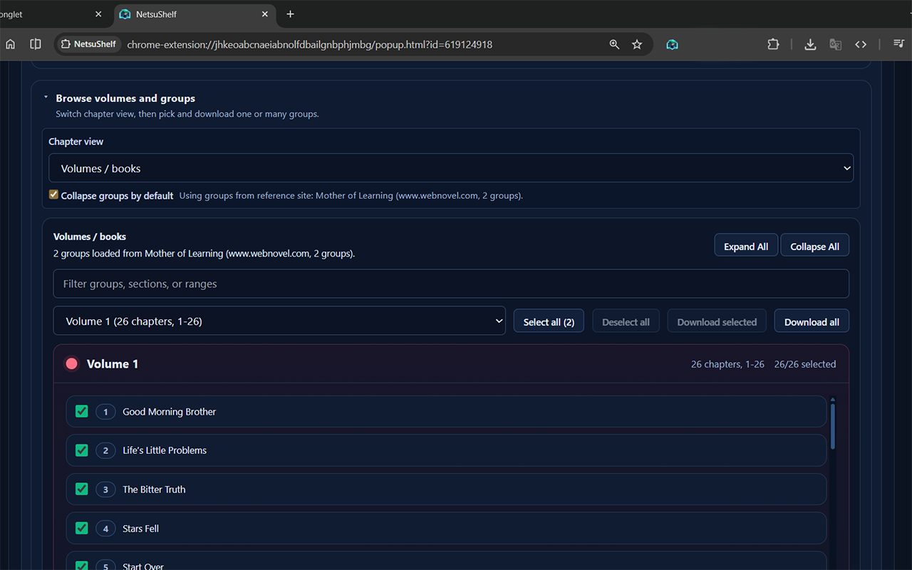
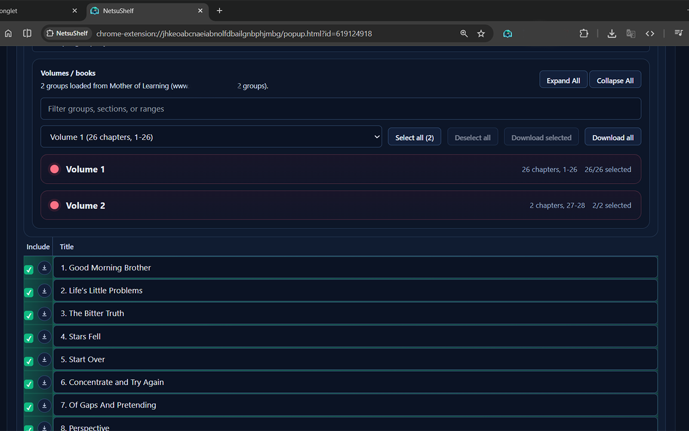

<div align="center">


# NetsuShelf

Turn web novels and story pages into EPUB, HTML, PDF or TXT files for offline reading.

[](https://chromewebstore.google.com/detail/netsushelf/bhnlehpkdcmjmekehjdpcdclggmogidc)
[](https://chromewebstore.google.com/detail/netsushelf/bhnlehpkdcmjmekehjdpcdclggmogidc)
[](https://addons.mozilla.org/firefox/addon/netsushelf/)
[](https://addons.mozilla.org/firefox/addon/netsushelf/)
[](https://github.com/NetsumaInfo/NetsuShelf/actions/workflows/node.js.yml)

</div>

A fork of [WebToEpub](https://github.com/dteviot/WebToEpub) with a rebuilt interface,
volume-aware downloads and reworked parsers.



## Install

| Browser | Install |
|---|---|
|  **Chrome** | [Chrome Web Store](https://chromewebstore.google.com/detail/netsushelf/bhnlehpkdcmjmekehjdpcdclggmogidc) |
|  **Firefox** | [addons.mozilla.org](https://addons.mozilla.org/firefox/addon/netsushelf/) |

Firefox 142.0 or later. Chrome needs Manifest V3 support.

<details>
<summary>Loading a development build by hand</summary>

> [!NOTE]
> The GitHub release is a development build, not the reviewed store build. See
> [Versions and releases](#versions-and-releases).

Download a `.zip` asset from [Releases](https://github.com/NetsumaInfo/NetsuShelf/releases) and
extract it.

**Chrome.** Open `chrome://extensions/`, turn on Developer mode, click *Load unpacked*, select the
extracted `plugin/` directory.

**Firefox.** Open `about:debugging#/runtime/this-firefox` and load it temporarily, or rename the
`.zip` to `.xpi` and install it as a package if you have a signed build.

</details>

## Using it

Open a story's table-of-contents page, or its first chapter on sites where the parser can walk
forward from there. Click the NetsuShelf icon, check the detected title, author, cover and chapter
list, choose what you want, then export.

Longer instructions live in the [wiki](https://github.com/NetsumaInfo/NetsuShelf/wiki) and on the
store listings.

## Features

### Output

Export as **EPUB**, **HTML**, **PDF** or **TXT**.

Two download modes. *Single file* produces one file for the whole selection. *Chapter packs*
splits the selection into files of *n* chapters, with *n* set in the popup. When a run produces
several files, they are delivered together as one `.zip` rather than as a burst of separate
downloads.

Individual chapters can also be downloaded one at a time from the chapter list.

### Choosing chapters



Pick a first and last chapter from the dropdowns, or type the numbers directly into the range
inputs. Beyond that: select, clear or invert the currently visible chapters, auto-select, filter
the list, and change the ordering. The chapter URLs can be shown, edited or copied to the
clipboard.

The panel reports which parser handled the page and how long it took, so a slow site is visible
rather than guessed at.

### Volumes and groups



The chapter list has three views: a flat list, the groups the site itself declares, or **volumes
and books**.

Many sites publish a story without usable volume markers. When that happens, NetsuShelf can pull
the grouping from a **reference site** that hosts the same story and map it onto the chapters you
have. Reference sites are detected from the page title, its metadata and the URL, and you pick
which one to use.



Once grouped, each volume shows its chapter count and range. From there you can expand or collapse
groups, filter by group, section or range, select all or none, and **download a selection of
volumes or every volume at once**, each as its own file.

### Metadata and cleanup

Title, author, language, filename and cover image URL are all editable before export.

Cleanup options cover author's notes, chapter numbers in titles, superscript handling, and the
next/previous chapter links that most sites embed in the text. For translated works there are
options to keep or drop the original text, the translation, or both.

### Library

Stories can be added to a local library held in the browser, so a series can be re-checked and
updated later instead of re-entered by hand. The library has its own compact view and can export
an EPUB automatically after an update.

### Advanced options

Around thirty-five settings sit behind *Advanced Options*, most of them off by default:

| Area | What you can change |
|---|---|
| Images | Highest-resolution variants, duplicate removal, source URLs, SVG wrapping, compression, JPEG covers, skipping images entirely |
| Errors and retries | Skip chapters that fail to fetch, retry for longer, override the minimum delay between requests, write an error history to a file |
| Metadata | Add an information page to the EPUB, use fewer tags, search for metadata automatically |
| Files | Overwrite on duplicate filename, use the full title as the filename |

## What this fork changes

Upstream does most of the work here: 1,866 of this repository's commits are dteviot's, against 25
of mine. The fork's own work is the rebuilt React and Tailwind popup with a dark theme, the
chapter-pack and multi-volume download paths, the reference-site group mapping, the chapter
selection tools, parser timing in the UI, and parser work concentrated on Lightnovelfr, Royal
Road, FreeWebNovel, Empirenovel, Chireads and Novellive, each with unit tests added.

Everything else is upstream's: the EPUB packer, the bulk of the parser set, the download pipeline.

## Supported sites

381 site parsers live in [`plugin/js/parsers/`](plugin/js/parsers/), almost all inherited from
upstream. Among the ones people ask about: Royal Road, Archive of Our Own, FanFiction.net,
WuxiaWorld, Baka-Tsuki, Webnovel, FreeWebNovel, Lightnovelfr.

A default parser handles many unsupported pages, with worse results than a dedicated one.

## Versions and releases

The version of record is `version` in [`plugin/manifest.json`](plugin/manifest.json), on a
four-part `1.0.12.x` scheme inherited from upstream. The `version` field in `package.json` is a
leftover and is not maintained; ignore it.

The store builds are the stable path. GitHub carries the development build.

> [!IMPORTANT]
> `developer-build` is a rolling tag, not a version. It is re-pointed at the newest development
> build each time one is produced, so "the latest release" means whatever was built most recently
> rather than a fixed version.

Assets are named:

```
NetsuShelf<version>.Chrome.zip
NetsuShelf<version>.Firefox.zip
```

for example `NetsuShelf1.0.12.8.Chrome.zip`.

> [!WARNING]
> Do not script against a `NetsuShelf.chrome.<version>.zip` pattern. Nothing is published under
> that name.

Builds come from [`AutoRelease.yml`](.github/workflows/AutoRelease.yml), which runs on a push to
`ExperimentalTabMode` or on manual dispatch with a `milestone`, `major`, `minor` or `dev`
increment.

## Permissions

| Permission | Used for |
|---|---|
| `<all_urls>` | Reading story pages and chapter content on any site a parser supports |
| `cookies` | Reaching chapters that need a logged-in session on the source site |
| `downloads` | Writing the finished file to your downloads folder |
| `webRequest`, `declarativeNetRequest` | Fetching chapter pages and images the way the source site expects |
| `scripting` | Running the parser inside the tab |
| `storage`, `unlimitedStorage` | The optional local library, held in the browser |

Conversion happens in the browser. See [PRIVACY.md](PRIVACY.md).

## Development

CI builds on Node 18.

```bash
npm install     # postinstall also builds the popup
npm run build   # rebuild the popup, then pack the extension into eslint/
npm run lint    # build, pack, then run eslint
```

`npm test` opens the unit tests in a browser (`http-server -o unitTest/Tests.html`). There is no
headless test command, because the tests need a DOM.

CI runs `npm install` and `npm run lint` on every push and pull request.

| Path | Contents |
|---|---|
| `plugin/` | Extension source |
| `plugin/js/parsers/` | The 381 site parsers |
| `ui/` | Popup React and Tailwind sources |
| `eslint/` | Packaging and release scripts, and the packed output |
| `unitTest/` | Browser-based tests |
| `doc/` | Store assets, wiki copy, project notes |

## Credits

NetsuShelf is a fork of [WebToEpub](https://github.com/dteviot/WebToEpub) by dteviot, who wrote
most of what is here. Upstream work included in this repository comes from dteviot, gamebeaker,
Kiradien, Leone Jacob Sunil and crybx.

## License

GPL-3.0-only, inherited from upstream. See [LICENSE.md](LICENSE.md).
